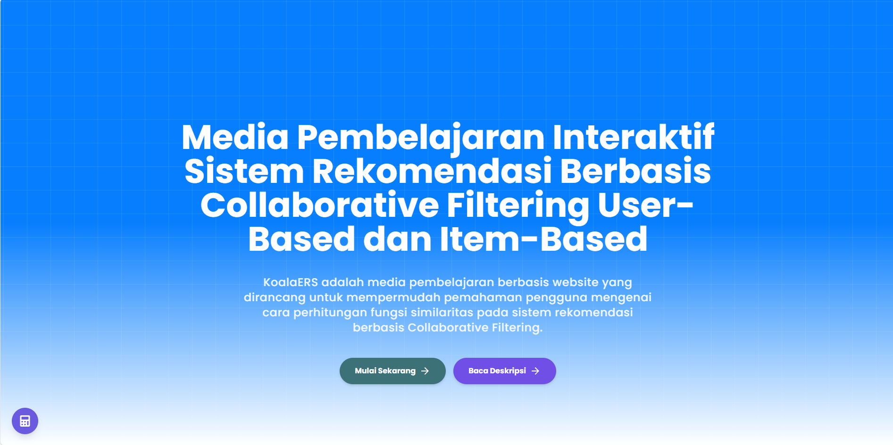

# 🐨 KoalaERS - Media Pembelajaran Sistem Rekomendasi Collaborative Filtering


<p align="center">
  
</p>

**KoalaERS** adalah aplikasi web interaktif untuk mempelajari dan menghitung fungsi similaritas pada Sistem Rekomendasi berbasis Collaborative Filtering. Aplikasi ini menyediakan tutorial lengkap dan kalkulator untuk berbagai metode similaritas.

## ✨ Fitur Utama

- 📚 **Tutorial Interaktif** - Pembelajaran step-by-step tentang fungsi similaritas
- 🧮 **Kalkulator Similaritas** - Hitung PCC, Cosine, Adjusted Cosine, dan Bhattacharyya Coefficient
- 📊 **Visualisasi Data** - Heatmap dan grafik interaktif untuk memahami hasil perhitungan
- 🌙 **Dark Mode** - Tampilan gelap untuk kenyamanan mata
- 📱 **Responsive Design** - Dapat diakses dari berbagai perangkat

## 🔢 Metode yang Didukung

| Metode Prediksi | Fungsi Similaritas                    |
| --------------- | ------------------------------------- |
| User-Based      | Pearson Correlation Coefficient (PCC) |
| Item-Based      | Cosine Similarity                     |
|                 | Adjusted Cosine Similarity            |
|                 | Bhattacharyya Coefficient (BC)        |

## 📁 Struktur Project

```
FrontEndSRP/
├── public/                     # Static files
│   ├── index.html
│   ├── favicon.ico
│   └── ...
├── src/
│   ├── api/                    # API calls & data fetching
│   │   ├── api.js
│   │   └── getDataSet.js
│   ├── assets/                 # Images, icons, videos
│   │   ├── icons/
│   │   ├── images/
│   │   └── vidioAsset/
│   ├── components/             # Reusable components
│   │   ├── Card/               # Card components
│   │   ├── DetailPerhitungan/  # Calculation detail components
│   │   ├── FloatingCalculator/ # Floating calculator
│   │   ├── Form/               # Form components
│   │   ├── Graph/              # Chart & visualization
│   │   ├── hooks/              # Custom React hooks
│   │   ├── Loading/            # Loading components
│   │   ├── MathSimilarity/     # Math formula components
│   │   ├── modal/              # Modal components
│   │   ├── Navigate/           # Navigation components
│   │   ├── table/              # Table components
│   │   └── Toggle/             # Toggle & switch components
│   ├── context/                # React Context (Theme)
│   ├── helper/                 # Helper functions & formulas
│   │   ├── Formula/
│   │   ├── generateEmot.js
│   │   ├── helper.js
│   │   └── Measure.js
│   ├── pages/                  # Page components
│   │   ├── About/
│   │   ├── detailPageView/
│   │   ├── ErorrPage/
│   │   ├── Exploration/
│   │   ├── Home/
│   │   ├── Layout/
│   │   └── Tutorial/
│   ├── styles/                 # CSS styles
│   ├── App.js                  # Main App component
│   ├── index.js                # Entry point
│   └── index.css               # Global styles
├── .env                        # Environment variables
├── package.json
├── tailwind.config.js
└── README.md
```

## 🚀 Getting Started

### Prerequisites

- Node.js >= 16.x
- npm >= 8.x atau yarn

### Installation

1. **Clone repository**

   ```bash
   git clone https://github.com/username/FrontEndSRP.git
   cd FrontEndSRP
   ```

2. **Install dependencies**

   ```bash
   npm install
   # atau
   yarn install
   ```

3. **Setup environment variables**

   ```bash
   cp .env.example .env
   # Edit .env sesuai kebutuhan
   ```

4. **Jalankan development server**

   ```bash
   npm start
   # atau
   yarn start
   ```

5. **Buka browser**
   ```
   http://localhost:3000
   ```

## 📜 Available Scripts

| Command         | Description                 |
| --------------- | --------------------------- |
| `npm start`     | Jalankan development server |
| `npm run build` | Build untuk production      |
| `npm test`      | Jalankan unit tests         |
| `npm run eject` | Eject dari Create React App |

## 🤝 Contributing

Kami menerima kontribusi! Berikut cara untuk berkontribusi:

1. **Fork repository ini**

2. **Clone fork kamu**

   ```bash
   git clone https://github.com/username-kamu/FrontEndSRP.git
   ```

3. **Buat branch baru**

   ```bash
   git checkout -b feature/nama-fitur
   ```

4. **Lakukan perubahan dan commit**

   ```bash
   git add .
   git commit -m "feat: deskripsi perubahan"
   ```

5. **Push ke fork kamu**

   ```bash
   git push origin feature/nama-fitur
   ```

6. **Buat Pull Request**
   - Buka repository original di GitHub
   - Klik "New Pull Request"
   - Pilih branch kamu dan submit PR

### Commit Convention

Gunakan format commit message berikut:

- `feat:` - Fitur baru
- `fix:` - Bug fix
- `docs:` - Dokumentasi
- `style:` - Formatting, styling
- `refactor:` - Code refactoring
- `test:` - Testing
- `chore:` - Maintenance

## 🛠️ Tech Stack

- **Frontend Framework:** React 18
- **Styling:** TailwindCSS, MUI (Material-UI)
- **State Management:** Zustand
- **Charts:** Chart.js, D3.js
- **Math Rendering:** MathJax
- **Routing:** React Router DOM
- **Animation:** AOS (Animate On Scroll)

## 👥 Tim Pengembang

**KoalaERS Team - Universitas Trunojoyo Madura**

- [@alfinur](https://github.com/alfiiinur) (Alfinur Danialin)
- [@dimasdliyaur](https://github.com/DimasDliyaurR) (Dimas Dliyaur Rahman)

## 📄 License

Project ini bersifat private dan dikembangkan untuk keperluan akademik.

---

<p align="center">
  Made with ❤️ by KoalaERS Team
</p>
